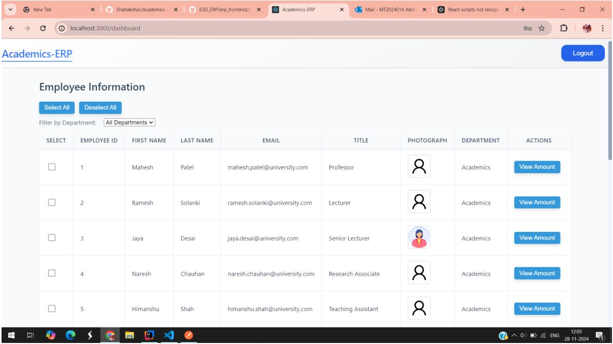
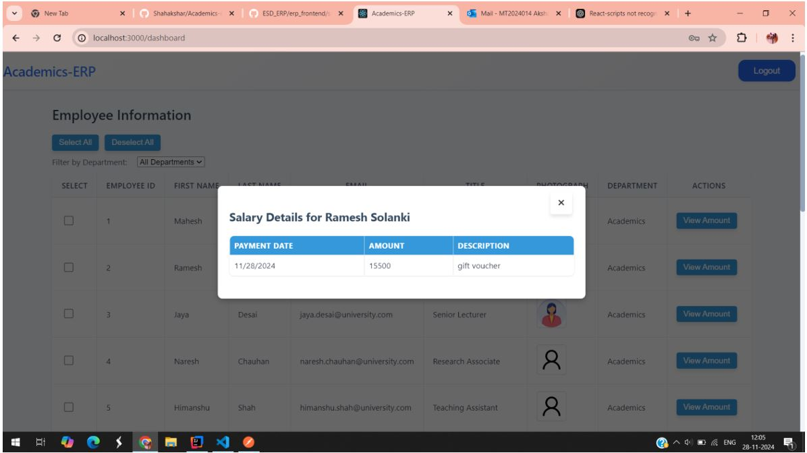
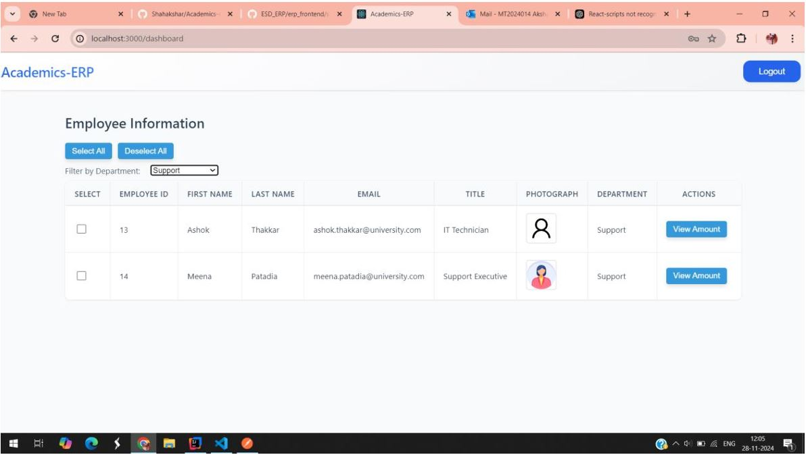
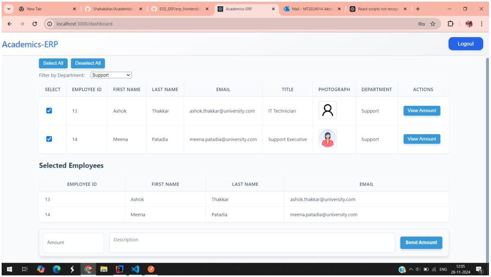
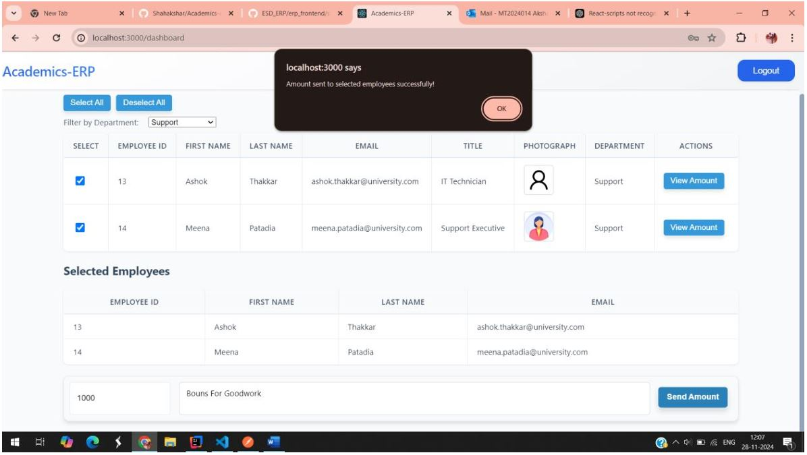
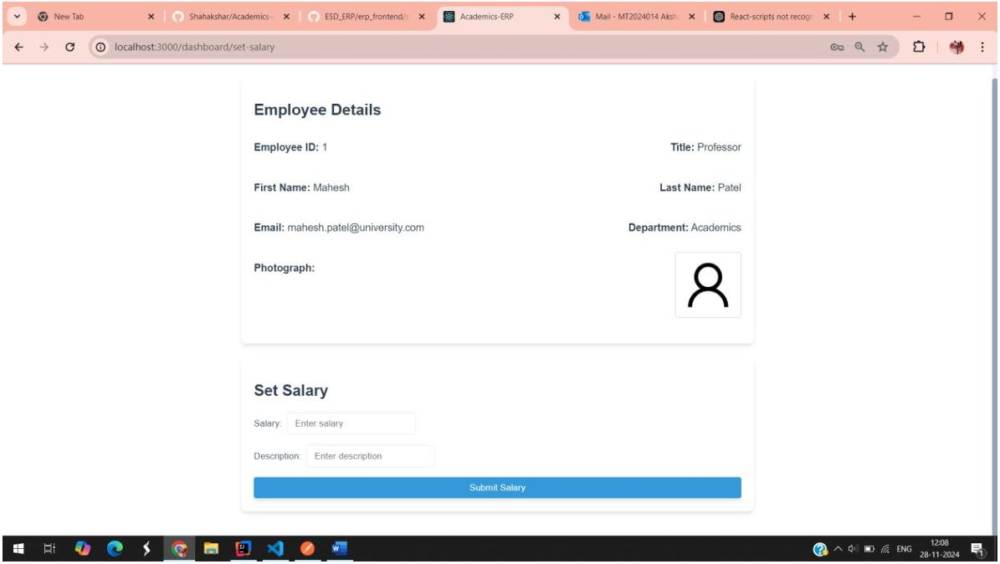

# SALARY DISBURSEMENT SYSTEM

A Salary Disbursement System that enables secure, consistent, and automated bulk salary payments for company employees.

### Key Features:
- **Asynchronous Processing** → Disbursement requests are queued via RabbitMQ and processed reliably in the backend.
- **Employee Transparency** → Salary slips are auto-generated, and employees receive real-time notifications after credit.
- **Audit & Reporting** → Immutable transaction logs and monthly reports ensure compliance and financial insights.

---
## 📸 Project Visuals

### 🧑‍💼 Login Page

---

### 📊 Dashboard Overview

---

### 💼 Salary Details View

---

### 📝 Modify Employee Salary

---

### 💸 Disburse Salary Interface

---

### 🔐 JWT Authentication Notice

---

### ⚙️ Account Settings / Configuration Panel

